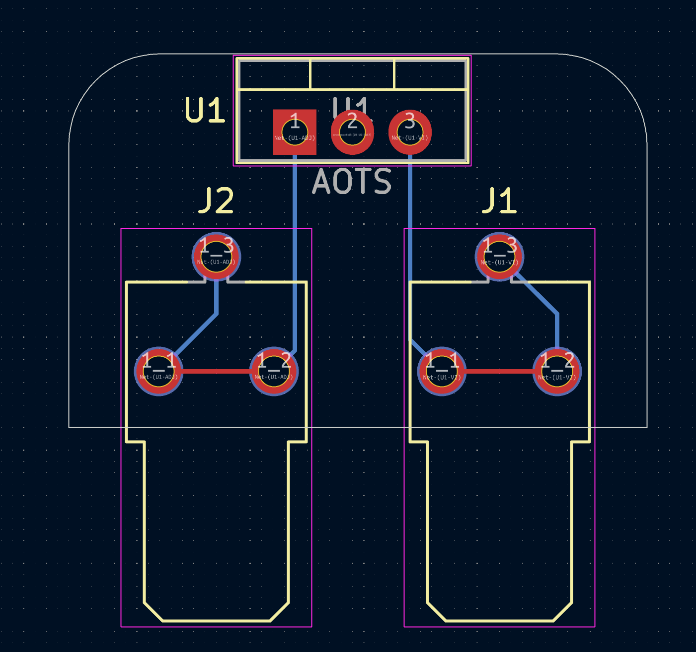

# TO220-2_to_crimps
Through hole TO-220 to 1/4 spade connectors adapter. intent is to have JLPB or PCB way create the parts I need.  
 
https://www.digikey.com/en/models/2170998  
 
https://www.sensata.com/products/temperature/6700-series-220-subminiature-thermostat
 

